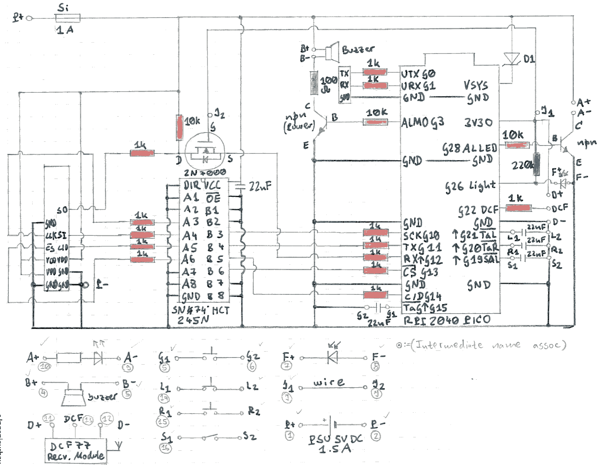
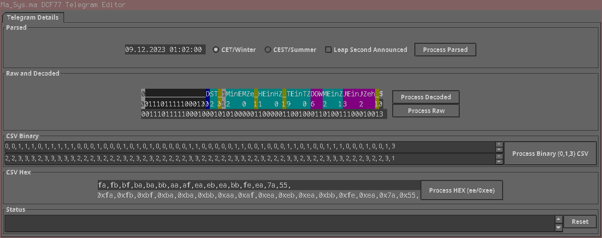
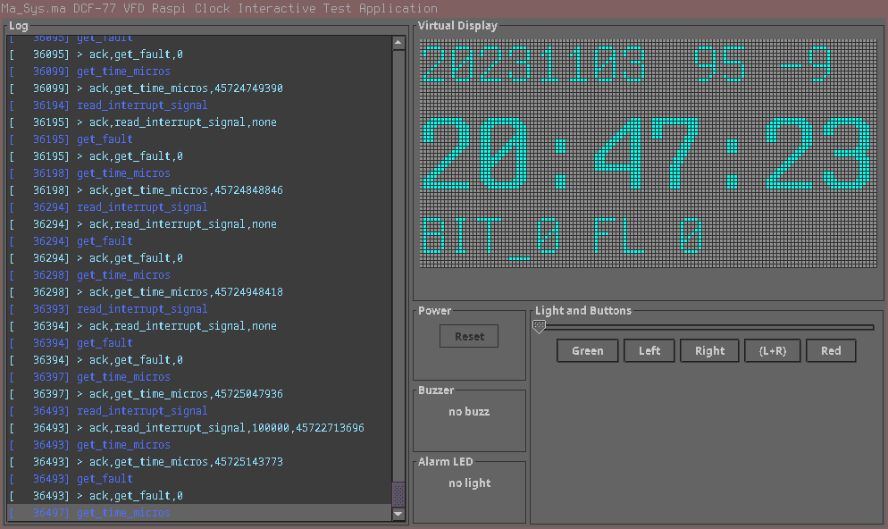

Übersicht
=========

Die _Ma_Sys.ma DCF77 VFD Raspi Clock_ ist eine selbst gebaute Digitalfunkuhr auf
Basis eines Vakuum-Floureszenzdisplays, welche durch einen Raspberry Pi Pico
(RP2040 Mikrocontroller) angesteuert wird und ihre Uhrzeit mittels eines
DCF77-Antennenmoduls empfängt.

Designziel der Uhr war es, möglichst viel Fehlerkorrektur bei der Auswertung der
DCF77-Signale einzubauen, sodass eine Uhrzeitsynchronisation trotz billiger
Antenne auch bei schlechten Empfangsbedingungen möglich ist. Weiterhin ist der
DCF77-Empfang kontinuierlich aktiv, sodass der Wechsel der Sekunden in der
Anzeige mit dem Empfang der Signalpulse synchron erfolgt.

_TODO PIC_

Repository-Inhaltsübersicht
===========================

_TODO TREE and lnk to sections_

Hardwaredesign
==============

Im Laufe der Entwicklung wurden verschiedene Hardwarevarianten durchgespielt
und dann jeweils wieder verworfen.

## Genereller Aufbau

 * Externes 5V Steckernetzteil
 * Externe Antenne
 * 4 Knöpfe zur Steuerung -- 3 Taster (_Modus, Zurück, Weiter_) und ein
   Druckschalter (Wecker Ein/Aus)
 * 5V VFD SPI-Displaymodul 128x64px
 * Buzzer als Weckalarm
 * Lichtsensor zur automatischen Helligkeitsanpassung

## Komponentenwahl

Bei den Komponenten wurde zuerst das Display festgelegt. Aus ästhetischen
Gründen wurde ein VFD gewählt. Das Displaymodul ermöglicht eine freie
Aufteilung des Bildschirminhalts und kommt dank SPI-Interface mit einer
überschaubaren Anzahl an Leitungen zur Ansteuerung aus.

Anfänglich wurde ein Arduino Nano v3 eingesetzt, allerdings stellte sich
nach langer Entwicklungsarbeit an der Software heraus, dass diese zu groß für
den Chip (und für die AVR-Architektur) geworden war. Daher wurde das Projekt auf
Basis des Raspberry Pi PICO (RP2040) neugestartet. Dadurch wurde eine Umsetzung
von den 3.3V IO-Spannung des RP2040 auf die 5V fürs Displaymodul erforderlich.
Typische Wandlerchips dafür scheinen alle nur als SMD-Bauteile verfügbar zu
sein. Daher wurde ein „Hack” mittels eines unidirektional genutzten Wandlerchips
(SN74HCT245N) implementiert.

Beim Gehäuse wurde anfänglich eine quadratische Version genutzt, in deren
Mitte dann ein großer Drehknauf plaziert worden wäre, mittels dessen man
verschiedene Bildschirme „durchschalten” hätte können. Allerdings war die
mechanische Stabilität zwischen Drehknauf und Achse schlecht und insgesamt die
Drehknauflösung sehr klobig. Daher wurde für die neue Revision auf ein
rechteckiges Gehäuse und statt eines Drehknaufs auf die Drucktaster für die
Steuerung und den Druckschalter für den Wecker gesetzt.

Somit bleibt die Information “Wecker gestellt” auch bei Stromausfall erhalten
und die Uhr kann beim Wiedereinschalten zwar nicht mehr die Weckzeit erinnern,
aber mittels Buzzer signalisieren, dass die Weckfunktion ausgefallen ist.

Die Antenne sollte anfänglich im Gehäuse integriert werden, nachdem der Empfang
aber aufgrund der Abstrahlung (oder Schirmung) durch die anderen Komponenten
quasi unmöglich war, wurde die Möglichkeit des Anschlusses einer externen
Antenne geschaffen. Da sich die Uhr aufgrund ihrer Größe und Versorgungsspannung
vielleicht auch „portabel” einsetzen lassen könnte und um in Zukunft mit
verschiedenen Antennenvarianten experimentieren zu können, wurde eine
Steckerverbindung zur Antenne vorgesehen.

## Blockschaltbild

	+-------------+           +--------+
	|             |---------->| Buzzer |
	| Netzteil 5V |           +--------+
	| +Sicherung  |               ^
	|             |   +-----+     |
	|             |-->| LED |     |
	|             |   +-----+     |
	|             |     ^         |
	|             |     |         |
	|             |   +----------------+
	|             |-->| Externe Last   |
	+-------------+   | per Transistor |   +------------------+
	      |           | geschaltet.    |<--| DCF77 Antenne    |
	      v           |                |   | (extern)         |
	+-------------+   |                |   +------------------+
	| VFD SPI     |   | RPI 2040 PICO  |
	| Display     |   |                |   +------------------+
	+-------------+   |                |<--| Lichtsensor      |
	      ^           | 3.3V erzeugt   |   +------------------+
	      |           | aus on-Board-  |
	+-------------+   | Regler         |   +------------------+
	| Wandler     |<--|                |<--| Schalter/Taster  |
	| SN74HCT245N |   |                |   | (Eingaben)       |
	+-------------+   +----------------+   +------------------+

Aufgrund des ursprünglich für den Arduino vorgesehenen Designs läuft das
Displaymodul mit 5V Betriebsspannung, die auch für das Netzteil als
Ausgangsspannung gewählt wurde.

Der RPI 2040 benötigt jedoch 3.3V für sämtliche I/O-Ports, sodass für die
Kommunikation mit dem Display der Wandler benötigt wird. Die 3.3V werden mit
dem auf dem Raspberry Pi PICO-Board befindlichen Wandler erzeugt, der genug
Strom liefert, um auch die Antenne und den Lichtsensor zu betreiben. Die
Lasten für die LED-Hintergrundbeleuchtung des Wecker-Schalters und für den
Buzzer werden über npn-Transistoren geschaltet.

## Schaltplan

Der gezeigte Schaltplan entspricht weitgehend der Realisierung: Eine Abweichung
gibt es lediglich bei der Beschaltung der nicht genutzten Kanäle des Wandlers:
In der praktischen Umsetzung wurden hier die im Datenblatt empfohlenen und im
Schaltplan fehlenden 10kOhm-Widerstände eingebaut, um die Robustheit weiter zu
erhöhen.

Der prinzipielle Aufbau ist so gestaltet, dass in den digitalen Signalen jeweils
1kOhm-Widerstände sitzen, um bei Fehlern zu verhindern, dass große Ströme
fließen können. Die Schalter- und Tastereingaben sind hardwareseitig mit
Kondensatoren entprellt. Die Schottky-Diode D1 verhindert, dass bei Anschluss
der USB-Schnittstelle am Raspi das VFD gespeist wird (es würde zu viel Strom
ziehen).

Der Feldeffekttransistor 2N7000 ist ein diskreter Logikwandler von den 5V des
Displays auf die 3.3V des Raspi. Da die Software von dieser
Kommunikationsrichtung keinen Gebrauch macht, könnte man ihn vermutlich auch
nicht bestücken, ohne die Funktionalität einzuschränken.

Die mit TX/RX/GND-bezeichneten Punkte sind für eine Stiftleiste zum Anschluss
eines Seriell-Wandlers gedacht, damit man am Rechner die Ausgaben des Programmes
auch ohne Eisnchränkung durch die Displaygröße nachvollziehen kann. Dieser
Weg war beim Debuggen hilfreich. Für die Umsetzung verschwindet die Stiftleiste
im Gehäuse (ebenso wie der USB-Port).

## Verdrahtungsplan

_TODO ... nochmal in besserer Qualität und mit mehr Farben einscannen!_

Softwaredesign
==============

Die Implementierung erfolgte in Ada, nachdem die Einschränkung auf C oder C++
durch den Arduino nicht mehr vorhanden war. Die Vielseitigkeit des
Ada-Typsystems lässt sich bei diesem Projekt gewinnbringend einsetzen, um
das vorherige „Bit Fiddling” aus der C-Implementierung abzulösen. Dank
Unterstützung für Subprozeduren und Module (Packages) können auch einige vormals
sehr längliche Identifier wieder etwas kürzer ausfallen. Beispiel: Der lange
Funktionsname `dcf77_secondlayer_check_bcd_correct_telegram_ignore_eom` ist
nicht mehr erforderlich, stattdessen ist es jetzt `Check_BCD_Correct_Telegram`
mit dem optionalen Parameter `Ignore_EOM` im Package `DCF77_Secondlayer`.

Entsprechend des Designziels beschäfigt sich der Großteil des Programmes mit der
DCF77-Decodierung. Die hardwarenahen Teile sind zentral in einem einzigen Modul
untergebracht (`DCF77_Low_Level`), sodass zum Test mit einer „virtuellen”
Hardware nur dieses Modul ersetzt und anders implementiert werden muss.

## DCF77-Decodierung

Vom Antennenmodul werden Pulse mit Längen von 100ms bzw. 200ms geliefert, um
eine logische 0 bzw. 1 zu codieren. Als Endmarkierung (60. Puls) bleibt der
Puls aus. Intern werden im Programm daher die Ablesungen (Reading) `Bit_0` (0),
`Bit_1` (1) und `No_Signal` (3) unterschieden.

Die unterste Abstraktionsebene stellt der _Bitlayer_ dar: Er ist dafür
zuständig, die eingehenden Pulslängen digital zu Reading zu codieren. Dazu wird
eine Zuordnungstabelle von Intervalllängen zu Ablesungen verwendet. Da sich das
im Laufe der Entwicklung als günstig herausstellte, implementiert der Bitlayer
auch die Funktion des _Tickers_, der dafür sorgt, dass der Code in definierten
Zeitintervallen von 100ms ausgeführt wird.

Darüber befindet sich der _Secondlayer_. Die Idee hinter dieser Schicht ist es,
die Ablesungen der letzten 9 Minuten vorzuhalten und anhand der Muster (bspw.
Lage der Endmarkierung) die einzelnen DCF77-Telegramme (Telegram) zu erkennen.
Außerdem wird zur Verbesserung des Empfangs ausgenutzt, dass sich innerhalb von
10 Minuten maximal 1x der Minuten-Zehner ändert. Damit können mehrere
aufeinanderfolgende Telegramme zusammengelegt werden, um fehlende empfangene
Bits (No_Signal) zu eliminieren (X_Eliminate). Insgesamt werden daraus bis zu
zwei Telegramme synthetisiert: Telegram_1 enthält das zuletzt vollständig
empfangene (“aktuelle”) Telegramm und Telegram_2 alles, was zum vorherigen
Minuten-Zehnerstand zugeordnet werden konnte.

Der _Timelayer_ nutzt diese Daten, um die eigentliche Decodierung durchzuführen.
Im einfachsten Fall ist der Empfang (nahezu) perfekt und das Datum und die
Uhrzeit lassen sich aus dem Telegram_1 vollständig decodieren. In diesem Fall
wird „perfekte Empfangsqualität” mittels _Quality Of Service 1_ (QOS1)
signalisiert. Falls eine derart einfache Decodierung nicht möglich ist, werden
verschiedene Verfahren zum Einsatz gebracht, um die fehlenden Daten zu
ermitteln, wobei mit höherem QOS-Wert die Qualität der Widerherstellung abnimmt.
Kann das Programm überhaupt keinen Zusammenhang mehr zwischen den empfangenen
Telegrammen und der aktuellen Uhrzeit herstellen fällt es auf `QOS9_ASYNC`
zurück, was so viel heißt, wie dass die Uhr asynchron zum DCF77-Zeitsignal
läuft. In diesem Fall wird anhand einer integrierten Berechnungsvorschrift
die Uhrzeit berechnet. Schaltjahre werden auch in diesem Falle berücksichtigt,
die Zeitumstellung jedoch nicht.

## Hardwareabstraktion

Die Ansteuerung der Hardware efolgt mittels der _Low-Level_-Bibliothek
(`DCF77_Low_Level`). Darüber hinaus wird für die Abstraktion des
Displayprotokolls eine eigene Bibliothek (`DCF77_Display`) genutzt.

## Bedienoberfläche

Die wesentliche Bedienlogik ist in der `DCF77_GUI` codiert. Das Modul ist
gleichzeitig auch der Einstiegspunkt für das Programm. Die Bedienlogik mit den
drei Tastern und zwei Schaltern ist in der Anleitung beschrieben (vgl. weiter
unten).

Die GUI übernimmt zusätzlich zu reinen “Anzeigefunktionen” auch noch folgende
Aufgaben:

 * Eingabe der Weckzeit
 * Einstellung von Datum- und Uhrzeit
 * Deaktivieren der DCF77-Decodierung (bspw. falls manipulierte
   falsche Daten empfangen werden sollten)

## Zusatzfunktionen

Das Modul `DCF77_Alarm` stellt die Berechnungen zur Erkennung des Eintretens
von Weckzeitpunkten bereit und verwaltet die Weckzeit, sowie die
Buzzersteuerung.

Im Modul `DCF77_Ambient_Light_Sensor` ist die Verstellung der Anzeigehelligkeit
in Abhängigkeit der Umgebungshelligkeit codiert.

Nachbau
=======

Die Software und Hardwarebeschreibung in diesem Repository sind
_Freie Software_. Daher ist u.A. ein Nachbau ohne Zahlung von Lizenzgebühren
möglich.

Grundsätzlich habe ich die Uhr bisher erst genau dieses eine Mal gebaut. Von
daher ist es nicht unwahrscheinlich, dass die Pläne noch den ein oder anderen
Fehler enthalten, der im Rahmen der Ausführung erst korrigiert wurde. Es ist
daher dringend geraten, Schaltplan, `DCF77_Low_Level` und Verdrahtungsplan
spätestens vor der 1. Inbetriebnahme abzugleichen.

## Software

Die Software kann mittels Alire-Buildtool kompiliert werden und
anschließend mit `elf2uf2` für den Raspberry konvertiert werden, sodass man
sie im Boot-Modus (BOOT-Taster gedrückt halten beim USB-Anschließen) auf den
am Hostsystem gemeldeten Massenspeicher kopieren kann.

Die genauen Kommandos zum Bauen der Software stehen im `build.xml`. Wenn
`ant`, `alr` und `elf2uf2` installiert sind, genügt ggfs. ein
`ant`-Aufruf, um das fertige Programm unter `bin/dcf77vfd.uf2` zu bauen.

## Stückliste

_TODO ..._

## Hardwarezusammenbau

Geeignete Werkzeuge für die Kunststoffbearbeitung und einen Lötkolben
vorausgesetzt, sollte der Zusammenbau weitgehend selbsterklärend sein.

Da das Antennenkabel relativ starr ist, gibt es ggfs. Sinn, es etwas länger
(bspw. 2m) zu wählen, damit man eine Chance hat, die Antenne auszurichten, ohne,
dass sie sich aufgrund der Starrheit des Kabels wieder in die falsche Position
dreht.

Tests
=====

Zur Software gehören diverse Test- und Hilfsprogramme, die bei der
DCF77-Entwicklung (ggfs. auch in anderen Projekten) helfen können.

## Telegramm-Editor

Im Ordner `telegram_editor` befindet sich ein in Java geschriebener
DCF77-Telegrammeditor, der sowohl Telegramme decodieren, als auch ein
„virtuelles” Telegramm zu einer gegebenen Datums- und Uhrzeitangabe berechnen
kann. Er unterstützt darüber hinaus mehrere CSV-Formate, die teilweise bei
der Entwicklung des 1. Implementierungsversuchs in C hilfreich waren.

## Simulator

Unter `src_simulated` befinden sich diverse Symlinks und einige zusätzliche
Dateien, mit denen sich das Programm auf dem Hostsystem kompilieren und ohne
die eigentliche Hardware ausführen lässt. Das Interface ist dann ein
„interaktives” Konsolenprogramm (stdin/stdout). Um dieses zu steueren wurde eine
GUI in Java entwickelt (`src_simulator_gui`), die das Executable startet und
die Interaktion per Pipe übernimmt. Damit kann man bspw. interaktiv die GUI
oder testen oder live zusehen, wie die virtuelle Uhr das vorgefertigte Telegramm
aus der enthaltenen `testvector.csv` verarbeitet.

## Test-Framework

Unter `test_framework` liegt ein Ada-Programm, welches zusammen mit dem Code
aus `src_simulated` zu einem `dcf77_test_runner` kompiliert werden kann.

Mit diesem Testprogramm lassen sich XML-Dateien laden, in denen jeweils
Testdaten in Form von Telegrammen und erwarteten Datums-Uhrzeit-Ergebnissen
oder relevanten Berechnungszwischenständen abgelegt sind.

Auf diese Weise lassen sich automatisiert auch sehr spezielle Fälle
wie bspw. Schaltsekunden testen. Mit gewissen Einschränkungen erlauben diese
Tests auch das Einstreuen von Störungen, indem man bspw. die 0/1-Werte aus
den Telegrammen durch Ersetzen mit 3-Ziffern überschreibt und somit
Empfangsprobleme simuliert.

Falls man ein eigenes DCF77-Projekt entwickelt, könnten insbesondere die
QOS-Testdaten interessant sein, da dort auch jeweils der erwartete Zeitstempel
angegeben ist, zu dem die Eingabedaten decodiert werden sollten.

Mittels `ant cov` im Ordner `test_framework` kann das Test-Framework auch
so aufgerufen werden, dass die _Line-Coverage_ mittels `lcov` ermittelt wird
und im Ordner `cov` ein HTML-Report abgelegt wird. Dieser Report kann hilfreich
sein, wenn man sich unsicher ist, ob ein gewisser Codeabschnitt überhaupt durch
die Tests erreicht wird.

Bedienungsanleitung
===================

_TODO INTRODUCTION TO MANUAL GOES HERE_

## Allgemeines

Im Allgemeinen können keine Einstellungen getätigt werden, die über das Trennen
der Stromversorgung hinaus Bestand haben (mit Ausnahme des Aktivierungszustands
der Weckfunktion).

_TODO EXPLAIN THE STATE CHART FOR GUI HERE (AND DRAW IT NICELY FIRST!)_

## Standardbetrieb mit DCF77-Antenne

Der empfohlene Standardsbetriebsmodus ist unter Verlass auf das
DCF77-Zeitsignal. Dazu muss die externe Antenne angeschlossen werden.
Anschließend wird das Netzteil angeschlossen und die Uhr synchronisiert
sich selbständig mit dem Zeitsignal.

Die gelungene Synchronisation kann jederzeit in der unteren linken Ecke
des Bildschirms abgelesen werden, wobei (+1) die beste Empfangsqualität
und (-9) die schlechteste Empfangsqualität signalisieren.

In der Mitte des Bildschirms wird die Uhrzeit dargestellt, darüber das Datum.
Unten rechts wird die eingestellte Weckzeit angezeigt, sofern der Wecker aktiv
ist.

## Menünavigation

Die 4-Tasten-Bedienung folgt folgender Überlegung:

 * Der linke grüne Taster (“Next/Edit”) ist für die Navigation “runter” bzw.
   innerhalb von Untermenüs für den Wechsel zwischen Bearbeiten/Navigieren
   gedacht.
 * Die mittleren beiden blauen Taster sind für das Verstellen von Zahlenwerten
   (+/-) bzw. die Navigationlinks/rechts gedacht.
 * Der rechte rote Schalter ist exklusiv für die Weckereinstellung gedacht:
   Ist er grdrückt ist der Weckalarm scharfgeschaltet und der Buzzer ertönt,
   sobald die eingestellte Weckzeit das nächste Mal erreicht wird.

## Wecker

### Weckzeit stellen

Zum Einstellen einer Weckzeit ist ausgehend vom Startbildschirm einmal
“Next/Edit” und dann “>” zu drücken. Anschließend lässt sich mit “Next/Edit”
das Bearbeiten des Stundenwerts aktivieren, mit +/- verstellen und
anschließend mit “Next/Edit” speichern und mit “>” zum nächsten Feld
(Weckzeit-Minute) wechseln. Dieses wird wieder mit “Next/Edit” bearbeitbar
gemacht, mit +/- verstellt und nochmals “Next/Edit” gespeichert. Ein Druck auf
“>” führt zurück zur Hauptansicht.

### Wecker scharfschalten

Zum Einschalten der Weckfunktion mit der aktuell hinterlegten Weckzeit muss
der rote Knopf gedrückt werden. Die aktive Weckfunktion wird durch die
orangene Hintergrundbeleuchtung des Knofpes signalisiert

### Wecker auslösen

Sobald die Weckzeit erreicht ist, löst der Wecker mittels Buzzergeräusch und
blinkendem Wecker-Schalter aus.

Sollte der Strom ausfallen oder aus anderen Gründen die Uhr bei aktivierterm
Wecker-Schalter mit der Spannungsversorgung verbunden werden, so aktiviert sich
der Buzzer sofort (unabhängig von einer eventuell vorher gestellten Weckzeit).
Damit wird verhindert, dass ein nächtlicher Stromausfall die Weckfunktion außer
Kraft setzt, allerdings kann es dadurch zu verfrüher Auslösung kommen.

### Wecker abstellen

Der Wecker kann durch Druck auf den Wecker-Schalter abgestellt werden.

Erfolgt ein solches Abstellen auch nach 90min nicht, schaltet sich der Wecker
in den “Timeout”-Modus -- der Buzzer wird abgeschaltet und der Wecker-Schalter
blinkt solange weiter, bis die Stromversorgung getrennt oder der Schalter
betätigt wurde.

## Uhrzeit verstellen

Eine verstllte Uhrzeit ist nur solange wirksam, wie kein anderslautendes Signal
per DCF77 empfangen wird. Um eine eigene Uhrzeitvorgabe dauerhaft festzulegen
muss die Antenne abgestöpselt werden. Im Betrieb ohne DCF77-Zeitsignal ist
jedoch mit einer starken Abweichung über die Zeit zu rechnen!

Mittels 2x “Next/Edit” navigiert man zum Uhhrzeitbearbeiten. Mit “>” wird das
Menü betreten und darin können der Reihe nach die Werte für Uhrzeit
(Stunde, Minute, Sekunde) und anschließend das Datum
(Jahrhundert, Jahr, Monat, Tag) bearbeitet werden. Das Bearbeiten der Zahlen
erfolgt analog zum Wecker-Stellen.

## Einstellungen verstellen

_TODO ..._

## Statusinformationen anzeigen

_TODO ..._

## Eigene Antenne anschließen

_TODO ..._
