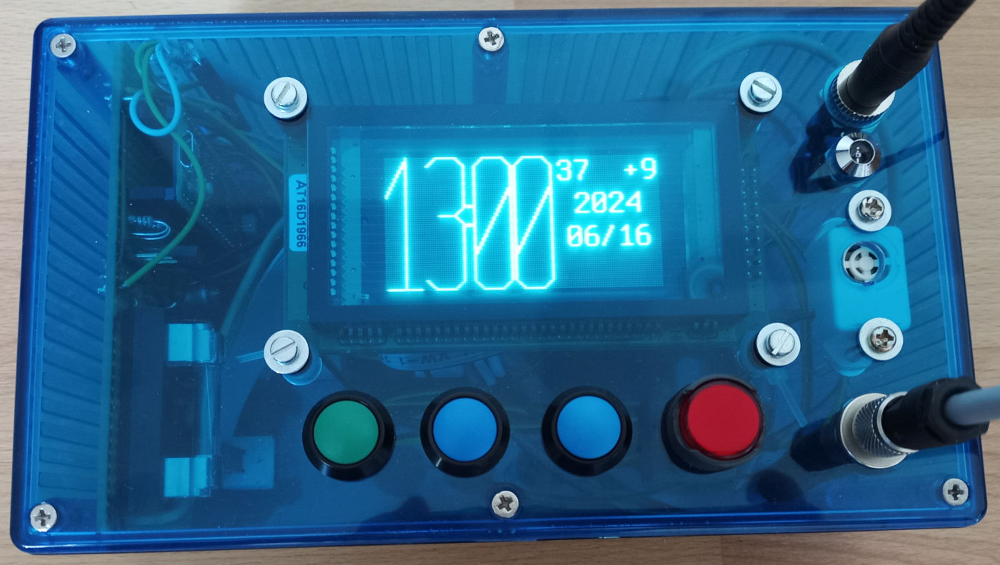

Bugs
====

**Achtung**: Diese Selbstbau-Uhr ist aktuell noch in einer Testphase. Sie
enthält noch kritische Bugs, die zu falscher Zeitanzeige führen können.

Notizen:

 * QOS9 observed in test GUI (maybe leap sec case related if that is in the
   test data. happens after some long time only?)
 * In at least one case, the clock crashed (halted). This should never happen.
 * In at least one case, a time 10min in the future was observed.

Übersicht
=========

Die _Ma_Sys.ma DCF77 VFD Raspi Clock_ ist eine selbst gebaute Digitalfunkuhr auf
Basis eines Vakuum-Floureszenzdisplays, welche durch einen Raspberry Pi Pico
(RP2040 Mikrocontroller) angesteuert wird und ihre Uhrzeit mittels eines
DCF77-Antennenmoduls empfängt.

Designziel der Uhr war es, möglichst viel Fehlerkorrektur bei der Auswertung der
DCF77-Signale einzubauen, sodass eine Uhrzeitsynchronisation trotz billiger
Antenne auch bei schlechten Empfangsbedingungen möglich ist. Weiterhin ist der
DCF77-Empfang kontinuierlich aktiv, sodass der Wechsel der Sekunden in der
Anzeige mit dem Empfang der Signalpulse synchron erfolgt.

Repository-Inhaltsübersicht
===========================

	bo-dcf77/
	 |
	 +-- dcf77vfd_raspi_block_att/ -- Ressourcendateien zur Webseite
	 |
	 +-- doc_gui_statechart/       -- Zustandsiagramm, siehe Abschnitt
	 |                                Bedienungsanleitung/Menünavigation
	 |
	 +-- release/                  -- Gesicherter Firmware-Binärstand
	 |
	 +-- src/                      -- Firmwarequelltext
	 |
	 +-- src_simulated/            -- Zusatzdateien für Kompilierung zur
	 |                                Ausführung auf einem PC-System
	 |
	 +-- src_simulated_gui/        -- Java-Simulationsanwendung, siehe
	 |                                Tests/Simulator
	 |
	 +-- telegram_editor/          -- (Java) DCF77-Telegrammeditor, siehe
	 |                                Tests/Telegramm-Editor
	 |
	 +-- test/                     -- Individuelle/Spezielle Testprogramme
	 |                                (idr. uninteressant für Benutzer)
	 |
	 +-- test_data/                -- DCF77-Testdatensätze
	 |                                zur Verarbeitung mit Test Framework
	 |
	 +-- test_framework/           -- Automatische Testanwendung, siehe
	 |                                Tests/Test-Framework
	 |
	 +-- xdev_font/                -- Quelldaten für eigene Schriftart
	 |
	 +-- xdev_impl1c/              -- alte C-Implementierung, 1. Versuch
	 |
	 +-- xdev_impl2c/              -- alte C-Implementierung, 2. Versuch
	 |
	 +-- xdev_misc/                -- vorbereitende Tests/Notizen
	 |
	 +-- README.md                 -- diese Beschreibung
	 |
	 +-- LICENSE.txt               -- Lizenz für die Uhr
	 +-- LICENSE-THIRDPARTY.txt    -- Lizenzübersicht für Komponenten
	 |
	 +-- dcf77vrd.gpr/alire.toml   -- Alire-Projektdateien zum Kompilieren
	 |
	 +-- build.xml                 -- Software-Bauinstruktionen für `ant`

Hardwaredesign
==============

Im Laufe der Entwicklung wurden verschiedene Hardwarevarianten durchgespielt
und dann jeweils wieder verworfen.

## Genereller Aufbau

 * Externes 5V Steckernetzteil
 * Externe Antenne
 * 4 Knöpfe zur Steuerung -- 3 Taster (_Modus, Zurück, Weiter_) und ein
   Druckschalter (Wecker Ein/Aus)
 * 5V VFD SPI-Displaymodul 128x64 px
 * Buzzer als Weckalarm
 * Lichtsensor zur automatischen Helligkeitsanpassung

## Komponentenwahl

Bei den Komponenten wurde zuerst das Display festgelegt. Aus ästhetischen
Gründen wurde ein VFD gewählt. Das Displaymodul ermöglicht eine freie
Aufteilung des Bildschirminhalts und kommt dank SPI-Interface mit einer
überschaubaren Anzahl an Leitungen zur Ansteuerung aus.

Anfänglich wurde ein Arduino Nano v3 eingesetzt, allerdings stellte sich
nach langer Entwicklungsarbeit an der Software heraus, dass diese zu groß für
den Chip (und für die AVR-Architektur) geworden war. Daher wurde das Projekt auf
Basis des Raspberry Pi PICO (RP2040) neugestartet. Dadurch wurde eine Umsetzung
von den 3.3V IO-Spannung des RP2040 auf die 5V fürs Displaymodul erforderlich.
Typische Wandlerchips dafür scheinen alle nur als SMD-Bauteile verfügbar zu
sein. Daher wurde ein „Hack” mittels eines unidirektional genutzten Wandlerchips
(SN74HCT245N) implementiert.

Beim Gehäuse wurde anfänglich eine quadratische Version genutzt, in deren
Mitte dann ein großer Drehknauf plaziert worden wäre, mittels dessen man
verschiedene Bildschirme „durchschalten” hätte können. Allerdings war die
mechanische Stabilität zwischen Drehknauf und Achse schlecht und insgesamt die
Drehknauflösung sehr klobig. Daher wurde für die neue Revision auf ein
rechteckiges Gehäuse und statt eines Drehknaufs auf die Drucktaster für die
Steuerung und den Druckschalter für den Wecker gesetzt.

Somit bleibt die Information “Wecker gestellt” auch bei Stromausfall erhalten
und die Uhr kann beim Wiedereinschalten zwar nicht mehr die Weckzeit erinnern,
aber mittels Buzzer signalisieren, dass die Weckfunktion ausgefallen ist.

Die Antenne sollte anfänglich im Gehäuse integriert werden, nachdem der Empfang
aber aufgrund der Abstrahlung (oder Schirmung) durch die anderen Komponenten
quasi unmöglich war, wurde die Möglichkeit des Anschlusses einer externen
Antenne geschaffen. Da sich die Uhr aufgrund ihrer Größe und Versorgungsspannung
vielleicht auch „portabel” einsetzen lassen könnte und um in Zukunft mit
verschiedenen Antennenvarianten experimentieren zu können, wurde eine
Steckerverbindung zur Antenne vorgesehen.

## Blockschaltbild

	+-------------+           +--------+
	|             |---------->| Buzzer |
	| Netzteil 5V |           +--------+
	| +Sicherung  |               ^
	|             |   +-----+     |
	|             |-->| LED |     |
	|             |   +-----+     |
	|             |     ^         |
	|             |     |         |
	|             |   +----------------+
	|             |-->| Externe Last   |
	+-------------+   | per Transistor |   +------------------+
	      |           | geschaltet.    |<--| DCF77 Antenne    |
	      v           |                |   | (extern)         |
	+-------------+   |                |   +------------------+
	| VFD SPI     |   | RPI 2040 PICO  |
	| Display     |   |                |   +------------------+
	+-------------+   |                |<--| Lichtsensor      |
	      ^           | 3.3V erzeugt   |   +------------------+
	      |           | aus on-Board-  |
	+-------------+   | Regler         |   +------------------+
	| Wandler     |<--|                |<--| Schalter/Taster  |
	| SN74HCT245N |   |                |   | (Eingaben)       |
	+-------------+   +----------------+   +------------------+

Aufgrund des ursprünglich für den Arduino vorgesehenen Designs läuft das
Displaymodul mit 5V Betriebsspannung, die auch für das Netzteil als
Ausgangsspannung gewählt wurde.

Der RPI 2040 benötigt jedoch 3.3V für sämtliche I/O-Ports, sodass für die
Kommunikation mit dem Display der Wandler benötigt wird. Die 3.3V werden mit
dem auf dem Raspberry Pi PICO-Board befindlichen Wandler erzeugt, der genug
Strom liefert, um auch die Antenne und den Lichtsensor zu betreiben. Die
Lasten für die LED-Hintergrundbeleuchtung des Wecker-Schalters und für den
Buzzer werden über npn-Transistoren geschaltet.

## Schaltplan

Der gezeigte Schaltplan entspricht weitgehend der Realisierung: Eine Abweichung
gibt es lediglich bei der Beschaltung der nicht genutzten Kanäle des Wandlers:
In der praktischen Umsetzung wurden hier die im Datenblatt empfohlenen und im
Schaltplan fehlenden 10kΩ-Widerstände eingebaut, um die Robustheit weiter zu
erhöhen.

Der prinzipielle Aufbau ist so gestaltet, dass in den digitalen Signalen jeweils
1kΩ-Widerstände sitzen, um bei Fehlern zu verhindern, dass große Ströme
fließen können. Die Schalter- und Tastereingaben sind hardwareseitig mit
Kondensatoren entprellt. Die Schottky-Diode D1 verhindert, dass bei Anschluss
der USB-Schnittstelle am Raspi das VFD gespeist wird (es würde zu viel Strom
ziehen).

Der Feldeffekttransistor 2N7000 ist ein diskreter Logikwandler von den 5V des
Displays auf die 3.3V des Raspi. Da die Software von dieser
Kommunikationsrichtung keinen Gebrauch macht, könnte man ihn vermutlich auch
weglassen, ohne die Funktionalität einzuschränken.

Die mit TX/RX/GND-bezeichneten Punkte sind für eine Stiftleiste zum Anschluss
eines Seriell-Wandlers gedacht, damit man am Rechner die Ausgaben des Programmes
auch ohne Eisnchränkung durch die Displaygröße nachvollziehen kann. Dieser
Weg war beim Debuggen hilfreich. Für die Umsetzung verschwindet die Stiftleiste
im Gehäuse (ebenso wie der USB-Port).

## Verdrahtungsplan

Der Verdrahtungsplan ist für eine Loch-Streifenrasterplatine vorgesehen, bei
der drei Löcher jeweils mit einem Streifen verbunden sind. Auf diese Weise
lassn sich ohne eigenes Platinenlayout Schaltungen realisieren.

Auf dem dargsetllten Verdrahtungsplan sind die 10kΩ-Widerstände zum Schutz
des Pegelwandlers noch nicht eingezeichnet, da diese erst bei der Bestückung
eingebaut wurden.

Bei den gelb markierten Drahtbrücken ist auf die Bestückungsreihenfolge zu
achten: Diese liegen teilweise unterhalb von anderen Teilen und müssen daher
vor diesen eingebaut werden.

## Antennenverbindung

Die Details zur Antennenverbindung sind in den Plänen nicht angegeben und daher
hier in einem eigenen Abschnitt angegeben. Der Antennenstecker und das Kabel
wurden folgendermaßen belegt:

Kabel  Bedeutung  Pin
-----  ---------  ---
gelb   +5V        1
weiß   +3.3V      2
grün   Signal     3
braun  GND        4

Für das ELV-Antennemodul genügen die 3.3V, die auch der Maximalwert sind, der
über _Signal_ ausgegeben werden darf. Falls ein Antennenmodul eine andere
Versorgungsspannung benötigt oder eine bessere Filterschaltung für die
Spannungsversorgung vorgeschaltet werden soll, können dank des 4-poligen
Steckers und Kabels aber auch die 5V des Netzteils direkt angezapft werden,
solange das Signal dann wieder mit Bezug auf die 3.3V ausgegeben wird.

Softwaredesign
==============

Die Implementierung erfolgte in Ada, nachdem die Einschränkung auf C oder C++
durch den Arduino nicht mehr vorhanden war. Die Vielseitigkeit des
Ada-Typsystems lässt sich bei diesem Projekt gewinnbringend einsetzen, um
das vorherige „Bit Fiddling” aus der C-Implementierung abzulösen. Dank
Unterstützung für Subprozeduren und Module (Packages) können auch einige vormals
sehr längliche Identifier wieder etwas kürzer ausfallen. Beispiel: Der lange
Funktionsname `dcf77_secondlayer_check_bcd_correct_telegram_ignore_eom` ist
nicht mehr erforderlich, stattdessen ist es jetzt `Check_BCD_Correct_Telegram`
mit dem optionalen Parameter `Ignore_EOM` im Package `DCF77_Secondlayer`.

Entsprechend des Designziels beschäfigt sich der Großteil des Programmes mit der
DCF77-Decodierung. Die hardwarenahen Teile sind zentral in einem einzigen Modul
untergebracht (`DCF77_Low_Level`), sodass zum Test mit einer „virtuellen”
Hardware nur dieses Modul ersetzt und anders implementiert werden muss.

## DCF77-Decodierung

Vom Antennenmodul werden Pulse mit Längen von 100ms bzw. 200ms geliefert, um
eine logische 0 bzw. 1 zu codieren. Als Endmarkierung (60. Puls) bleibt der
Puls aus. Intern werden im Programm daher die Ablesungen (Reading) `Bit_0` (0),
`Bit_1` (1) und `No_Signal` (3) unterschieden.

Die unterste Abstraktionsebene stellt der _Bitlayer_ dar: Er ist dafür
zuständig, die eingehenden Pulslängen digital zu Reading zu codieren. Dazu wird
eine Zuordnungstabelle von Intervalllängen zu Ablesungen verwendet. Da sich das
im Laufe der Entwicklung als günstig herausstellte, implementiert der Bitlayer
auch die Funktion des _Tickers_, der dafür sorgt, dass der Code in definierten
Zeitintervallen von 100ms ausgeführt wird.

Darüber befindet sich der _Secondlayer_. Die Idee hinter dieser Schicht ist es,
die Ablesungen der letzten 9 Minuten vorzuhalten und anhand der Muster (bspw.
Lage der Endmarkierung) die einzelnen DCF77-Telegramme (Telegram) zu erkennen.
Außerdem wird zur Verbesserung des Empfangs ausgenutzt, dass sich innerhalb von
10 Minuten maximal 1x der Minuten-Zehner ändert. Damit können mehrere
aufeinanderfolgende Telegramme zusammengelegt werden, um fehlende empfangene
Bits (No_Signal) zu eliminieren (X_Eliminate). Insgesamt werden daraus bis zu
zwei Telegramme synthetisiert: Telegram_1 enthält das zuletzt vollständig
empfangene (“aktuelle”) Telegramm und Telegram_2 alles, was zum vorherigen
Minuten-Zehnerstand zugeordnet werden konnte.

Der _Minutelayer_ nutzt diese Daten, um die eigentliche Decodierung
durchzuführen. Im einfachsten Fall ist der Empfang (nahezu) perfekt und das
Datum und die Uhrzeit lassen sich aus dem Telegram_1 vollständig decodieren. In
diesem Fall wird „perfekte Empfangsqualität” mittels _Quality Of Service 1_
(QOS1) signalisiert. Falls eine derart einfache Decodierung nicht möglich ist,
werden verschiedene Verfahren zum Einsatz gebracht, um die fehlenden Daten zu
ermitteln, wobei mit höherem QOS-Wert die Qualität der Widerherstellung abnimmt.
Kann das Programm überhaupt keinen Zusammenhang mehr zwischen den empfangenen
Telegrammen und der aktuellen Uhrzeit herstellen fällt es auf `QOS9_ASYNC`
zurück, was so viel heißt, wie dass die Uhr asynchron zum DCF77-Zeitsignal
läuft.

Eine Schicht oberhalb befindet sich der _Timelayer_, der eine Konsistenzprüfung
aufeinanderfolgender ausgegebener Uhrzeiten vornimmt und abhängig vom
aktuellen QOS-Level den Ergebnissen des Minutelayer Priorität einräumt oder
unter Umständen auch ein berechnetes Ergebnis gegenüber dem angeblich
decodierten bevorzugt. Dies dient der Vermeidung von extremen Zeitsprüngen, die
auftreten können, wenn fälschlicherweise zusätzliche Signale erkannt werden.
Dadurch können nämlich der Secondlayer und Minutelayer durcheinander geraten und
fehlerhafte Datums- und Uhrzeitinformationen liefern. Der Status des Timelayers
wird mit einem Zeichen (`+`, `o` oder `-`) dargestellt, wobei `+` darauf
hinweist, dass die Berechnungen mit den Beobachtungen übereinstimmen und somit
eine synchronisierte und verlässliche Uhrzeit angezeigt wird.

## Hardwareabstraktion

Die Ansteuerung der Hardware efolgt mittels der _Low-Level_-Bibliothek
(`DCF77_Low_Level`). Darüber hinaus wird für die Abstraktion des
Displayprotokolls eine eigene Bibliothek (`DCF77_Display`) genutzt.

## Bedienoberfläche

Die wesentliche Bedienlogik ist in der `DCF77_GUI` codiert. Das Modul ist
gleichzeitig auch der Einstiegspunkt für das Programm. Die Bedienlogik mit den
drei Tastern und zwei Schaltern ist in der Anleitung beschrieben (vgl. weiter
unten).

Die GUI übernimmt zusätzlich zu reinen “Anzeigefunktionen” auch noch folgende
Aufgaben:

 * Eingabe der Weckzeit
 * Einstellung von Datum- und Uhrzeit
 * Deaktivieren der DCF77-Decodierung (hauptsächlich zu Testzwecken interessant)

## Zusatzfunktionen

Das Modul `DCF77_Alarm` stellt die Berechnungen zur Erkennung des Eintretens
von Weckzeitpunkten bereit und verwaltet die Weckzeit, sowie die
Buzzersteuerung.

Im Modul `DCF77_Ambient_Light_Sensor` ist die Verstellung der Anzeigehelligkeit
in Abhängigkeit der Umgebungshelligkeit codiert.

Nachbau
=======

Grundsätzlich habe ich die Uhr bisher erst genau dieses eine Mal gebaut. Von
daher ist es nicht unwahrscheinlich, dass die Pläne noch den ein oder anderen
Fehler enthalten, der im Rahmen der Ausführung erst korrigiert wurde. Es ist
daher dringend geraten, Schaltplan, `DCF77_Low_Level` und Verdrahtungsplan
spätestens vor der 1. Inbetriebnahme abzugleichen.

## Lizenz

Die Software und Hardwarebeschreibung in diesem Repository sind
_freie Software_. Damit ist bspw. ein Nachbau ohne Zahlung von Lizenzgebühren
möglich. Alles in diesem Repository enthaltene außer `release/` und
`src/dcf77_display-font.ads` steht unter folgender Expat-Lizenz:

~~~
MIT License

Ma_Sys.ma DCF77 VFD Raspi Clock (c) 2018-2024 Ma_Sys.ma <info@masysma.net>

Permission is hereby granted, free of charge, to any person obtaining a copy
of this software and associated documentation files (the "Software"), to deal
in the Software without restriction, including without limitation the rights
to use, copy, modify, merge, publish, distribute, sublicense, and/or sell
copies of the Software, and to permit persons to whom the Software is
furnished to do so, subject to the following conditions:

The above copyright notice and this permission notice shall be included in all
copies or substantial portions of the Software.

THE SOFTWARE IS PROVIDED "AS IS", WITHOUT WARRANTY OF ANY KIND, EXPRESS OR
IMPLIED, INCLUDING BUT NOT LIMITED TO THE WARRANTIES OF MERCHANTABILITY,
FITNESS FOR A PARTICULAR PURPOSE AND NONINFRINGEMENT. IN NO EVENT SHALL THE
AUTHORS OR COPYRIGHT HOLDERS BE LIABLE FOR ANY CLAIM, DAMAGES OR OTHER
LIABILITY, WHETHER IN AN ACTION OF CONTRACT, TORT OR OTHERWISE, ARISING FROM,
OUT OF OR IN CONNECTION WITH THE SOFTWARE OR THE USE OR OTHER DEALINGS IN THE
SOFTWARE.
~~~

Da diese Entwicklung unter Anderem eine Schriftart unter SIL OFL und die
Hardwareabstraktion zur Programmierung des RP2040 mittels Ada verwendet, sind
weitere Lizenzen für diese Komponenten anwendbar, die sich auf den im Repository
enthaltenen Ordner `release/` und die Datei `src/dcf77_display-font.ads`
auswirken. Alle anwendbaren Lizenzen für diese Komponenten sind in der Datei
`LICENSE-THIRDPARTY.txt` zusammengestellt.

## Software

Die Software kann mittels Alire-Buildtool kompiliert werden und
anschließend mit `elf2uf2` für den Raspberry konvertiert werden, sodass man
sie im Boot-Modus (BOOT-Taster gedrückt halten beim USB-Anschließen) auf den
am Hostsystem gemeldeten Massenspeicher kopieren kann.

Die genauen Kommandos zum Bauen der Software stehen im `build.xml`. Wenn
`ant`, `alr` und `elf2uf2` installiert sind, genügt ggfs. ein
`ant`-Aufruf, um das fertige Programm unter `bin/dcf77vfd.uf2` zu bauen.

## Stückliste

Die folgende Stückliste beschreibt, welche Teile in der Uhr verbaut wurden. Im
Laufe der Entwicklung wurden noch deutlich mehr Teile (bspw. Gehäuse- und
Schaltervarianten, Arduino Nano) bestellt, die jedoch nicht alle im finalen
Design enthalten sind.

Inzwischen sind schon nicht mehr alle Teile lieferbar. Die meisten Teile lassen
sich jedoch gegen gleichwertige Alternativen ersetzen.

Einzig die schlechte Verfügbarkeit des Displays könnte einen Nachbau behindern.
Beim Reichelt war es zum Zeitpunkt der Erstellung dieser Dokumentation nämlich
nicht mehr lieferbar. Die Wahl eines alternativen Displays kann Anpassungen
am Schaltplan, Verdrahtungsplan und am Displaytreiber (`DCF77_Display`)
erforderlich machen.

Lieferant     Anzahl  Beschreibung                      Stückpreis/€  Gesamtpreis/€  Bestellnummer mit Link
------------  ------  --------------------------------  ------------  -------------  --------------------------------------------------------------------------------------------------------------------------------------------------------------------
conrad.de     1       Antennengehäuse                   3.79          3.79           [1977726-62](https://www.conrad.de/de/p/tru-components-tc-7910904-universal-gehaeuse-63-x-57-x-37-abs-pc-grau-1-st-1977726.html)
conrad.de     1       Buchse für Antennenanschluss      11.04         11.04          [738657-62](https://www.conrad.de/de/p/binder-09-0412-00-04-rundstecker-flanschbuchse-gesamtpolzahl-4-serie-rundsteckverbinder-712-1-st-738657.html)
conrad.de     10*     Feinsicherung 6.3x32 1.0A T                     3.79           [523965-62](https://www.conrad.de/de/p/eska-632-317-632317-feinsicherung-o-x-l-6-3-mm-x-32-mm-1-a-250-v-traege-t-inhalt-10-st-523965.html)
conrad.de     1       Flachbandkabel 20pol RM2.54       2.70          2.70           [2103807-62](https://www.conrad.de/de/p/bkl-electronic-10120672-flachbandkabel-rastermass-2-54-mm-20-x-0-08-mm-grau-1-st-2103807.html)
conrad.de     1       Gehäuse                           20.99         20.99          [522512-62](https://www.conrad.de/de/p/hammond-electronics-1591-etbu-universal-gehaeuse-191-x-110-x-61-polycarbonat-blau-1-st-522512.html)
conrad.de     1       Kabelverschraubung M12 (f.Ant.)   0.56          0.56           [1521098-62](https://www.conrad.de/de/p/kvm1m-kabelverschraubung-verschraubbar-mit-gegenmutter-m12-m12-polyamid-grau-1-st-1521098.html)
conrad.de     1       Lichtsensor NaPiCa AMS302         2.85          2.85           504926-62
conrad.de     1       Stecker für Antenne               12.99         12.99          [738864-62](https://www.conrad.de/de/p/binder-99-0409-00-04-rundstecker-stecker-gerade-gesamtpolzahl-4-serie-rundsteckverbinder-712-1-st-738864.html)
conrad.de     2       Steuerleitung 4x0.25mm²  (Ant.)   2.29          4.58           [1180024-62](https://www.conrad.de/de/p/voka-kabelwerk-liycy-steuerleitung-4-x-0-25-mm-grau-102104-00-meterware-1180024.html)
conrad.de     1       Summer KPMB-G2206L-K6405          3.29          3.29           715057-62
conrad.de     1       Taster Grün                       4.79          4.79           [701259-62](https://www.conrad.de/de/p/tru-components-701259-gq12b-a-gn-vandalismusgeschuetzter-drucktaster-48-v-dc-2-a-1-x-aus-ein-tastend-ip65-1-st-701259.html)
conrad.de     2       Taster Blau                       4.99          9.98           [701260-62](https://www.conrad.de/de/p/tru-components-gq12b-a-bl-vandalismusgeschuetzter-drucktaster-48-v-dc-2-a-1-x-aus-ein-tastend-ip65-1-st-701260.html)
conrad.de     4       Abstandsbolzen 7mm x 10mm         0.10          0.60           [526363-62](https://www.conrad.de/de/p/526363-abstandsbolzen-o-x-l-7-mm-x-10-mm-polystyrol-1-st-526363.html)
conrad.de     100*    Widerstände 10k 0.25W 5% (Pkg)                  2.29           [1584380-62](https://www.conrad.de/de/p/tru-components-1584380-tc-cfr0w4j0102kit203-kohleschicht-widerstand-1-k-axial-bedrahtet-0207-0-25-w-5-100-st-1584380.html)
conrad.de     100*    Widerstände 1k 0.25W 5% (Pkg)                   2.29           [1584383-62](https://www.conrad.de/de/p/tru-components-1584383-tc-cfr0w4j0103kit203-kohleschicht-widerstand-10-k-axial-bedrahtet-0207-0-25-w-5-100-st-1584383.html)
conrad.de     1       Versandkosten ab 59.95€ = 0       0.00          0.00            
elv.de        1       DCF-Empfangsmodul DCF-2 (Ant.)    9.95          9.95           [091610](https://de.elv.com/dcf-empfangsmodul-dcf-2-091610)
elv.de        1       Versandkosten Best.-Wert. < 29€   3.99          3.99            
reichelt.de   1       Abdeckung f. Operator, rund, rot  0.71          0.71           [A01-63 ROT](https://www.reichelt.de/abdeckung-fuer-operator-rund-rot-a01-63-rot-p27936.html)
reichelt.de   1       Anschlussbuchse 5.6mm/2.1mm       1.25          1.25           [HEBLM 21](https://www.reichelt.de/einbaubuchse-zentraleinbau-aussen-5-6-mm-innen-2-1-mm-heblm-21-p35268.html)
reichelt.de   2       Buchsenleiste 20-pol, RM2.54      0.30          0.60           [BL 1x20G8 2,54](https://www.reichelt.de/20pol-buchsenleiste-gerade-rm-2-54-h-8-5mm-bl-1x20g8-2-54-p51827.html)
reichelt.de   1       IC-Sockel 20-pol                  0.08          0.08           [GS 20](https://www.reichelt.de/ic-sockel-20-polig-doppelter-federkontakt-gs-20-p8212.html)
reichelt.de   1       LED 6V für Serie A01 - amber      6.20          6.20           [A01 LED6V GE](https://www.reichelt.de/led-6-v-fuer-serie-a01-amber-a01-led6v-ge-p167419.html)
reichelt.de   1       LED-Halter Außenreflektor         0.90          0.90           [VOSS WU-A-5](https://www.reichelt.de/nicht-mehr-lieferbar-voss-wu-a-5-p232320.html)
reichelt.de   100*    Karosseriescheiben 3.2mm          1.99          1.99           [SKA 3,2X9-100](https://www.reichelt.de/karosseriescheiben-3-2-mm-100-stueck-ska-3-2x9-100-p65774.html)
reichelt.de   4       Kondensator 22nF                  0.10          0.40           [X7R-2,5 22N MUR](https://www.reichelt.de/vielschicht-keramikkondensator-22n-10--x7r-2-5-22n-mur-p22856.html?r=1)
reichelt.de   2       MOSFET (1 Reserve)                0.08          0.16           [2N 7000 DIO](https://www.reichelt.de/mosfet-n-ch-60v-0-115a-0-4w-to-92-2n-7000-dio-p219075.html)
reichelt.de   100*    Muttern M2.5                      1.85          1.85           [SK M2,5-100](https://www.reichelt.de/sechskantmuttern-m2-5-100-stueck-sk-m2-5-100-p18082.html)
reichelt.de   1       Netzteil 5V 1.5A 5.5mmx2.1mm      7.20          7.20           [HNP 06-050L6](https://www.reichelt.de/steckernetzteil-7-5-w-5-v-1-5-a-hnp-06-050l6-p177069.html)
reichelt.de   1       Operator, bel.bar, rastend, rund  7.20          7.20           [A01-09R](https://www.reichelt.de/operator-beleuchtbar-rastend-rund-a01-09r-p27923.html)
reichelt.de   1       Punkt-Streifenrasterp. 160x100mm  2.70          2.70           [H25PS160](https://www.reichelt.de/punkt-streifenrasterplati-hartpapier-160x100mm-h25ps160-p23953.html)
reichelt.de   1       Raspberry Pi Pico, RP2040         3.95          3.95           [RASP PI PICO](https://www.reichelt.de/de/de/raspberry-pi-pico-rp2040-cortex-m0-microusb-rasp-pi-pico-p295706.html)
reichelt.de   1       Schalterblock f. A01, 2xUM        6.68          6.68           [A01-52B](https://www.reichelt.de/schalterblock-fuer-a01-6a-250vac-2-polig-um-a01-52b-p27916.html)
reichelt.de   1       Schottkydiode (1 Reserve)         0.07          0.14           [1N 5819RL STM](https://www.reichelt.de/schottkydiode-40-v-1-a-do-41-1n-5819rl-stm-p219449.html)
reichelt.de   200*    Schrauben M2.5 12mm Schlitz       1.99          1.99           [SZK M2,5X12-200](https://www.reichelt.de/zylinderkopfschrauben-schlitz-m2-5-12-mm-200-stueck-szk-m2-5x12-200-p130239.html)
reichelt.de   1       Sicherungshalter 6.3mm x 32mm     1.60          1.60           [SCH 318002](https://www.reichelt.de/sicherungshalter-fuer-6-3-x-32-mm-250-v-10-a-schwarz-sch-318002-p245390.html)
reichelt.de   1       Stiftleiste 1x3-pol RM2.54        0.08          0.08           [MPE 087-1-003](https://www.reichelt.de/stiftleisten-2-54-mm-1x03-gerade-mpe-087-1-003-p119880.html)
reichelt.de   2       Stiftleiste 1x20-pol RM2.54       0.36          0.72           [MPE 087-1-020](https://www.reichelt.de/stiftleisten-2-54-mm-1x20-gerade-mpe-087-1-020-p119888.html)
reichelt.de   1       Stiftleiste 2x10-pol RM2.54       0.35          0.35           [MPE 087-2-020](https://www.reichelt.de/stiftleisten-2-54-mm-2x10-gerade-mpe-087-2-020-p119898.html)
reichelt.de   2       Transceiver (1 Reserve)           0.70          1.40           [SN 74HCT245N TEX](https://www.reichelt.de/transceiver-octal-4-5--5-5-v-pdip-20-sn-74hct245n-tex-p219305.html)
reichelt.de   1       VFD-Displaymodul 5V               39.30         39.30          [LCD-128X64BK AA](https://www.reichelt.de/nicht-mehr-lieferbar-lcd-128x64bk-aa-p197556.html)
reichelt.de   1       Widerstand 100Ω, 2W               0.10          0.10           [VIS PRO200020103](https://www.reichelt.de/widerstand-metallschicht-100-ohm-2-w-5--vis-pr0200020103-p284585.html)
reichelt.de   1       Versandkosten (immer)             5.95          5.95            
Vorrat        1       Anschlusskabel für Lichtsensor                                  
Vorrat        3       Kabelbinder                                                     
Vorrat                Lötzinn bleifrei                                                
Vorrat        1       npn-Transistor klein                                            
Vorrat        1       npn-Transistor Leistung                                         
Vorrat        3       Schaltlitze Schalteranschluss                                   
Vorrat        1       Widerstand 220kΩ                                                

*) Packungsgröße, effektiv wurden nicht alle Teile verbaut,
Vorrat := Wurde nicht extra für dieses Projekt eingekauft und daher auch nicht
in den Kosten erfasst.

Gesamtkosten nur für benötigte Teile 193.97€ davon 9.95€ Versand.

## Hardwarezusammenbau

Geeignete Werkzeuge für die Kunststoffbearbeitung und einen Lötkolben
vorausgesetzt, sollte der Zusammenbau weitgehend selbsterklärend sein.

Da das Antennenkabel relativ starr ist, gibt es ggfs. Sinn, es etwas länger
(bspw. 2m) zu wählen, damit man eine Chance hat, die Antenne auszurichten, ohne,
dass sie sich aufgrund der Starrheit des Kabels wieder in die falsche Position
dreht.

## Skizzen zu Komponenten

Zum fehlerfreien Zusammenbau der Uhr wurden einige Skizzen angefertigt. Für den
Nachbau können diese gerne zu Rate gezogen werden, sollten aber anhand der
tatsächlich vorliegenden Teile, Pläne und Datenblätter kontrolliert werden, da
bspw. bei den Maßen des Displays Unstimmigkeiten bestehen können.

Tests
=====

Zur Software gehören diverse Test- und Hilfsprogramme, die bei der
DCF77-Entwicklung (ggfs. auch in anderen Projekten) helfen können.

## Telegramm-Editor

Im Ordner `telegram_editor` befindet sich ein in Java geschriebener
DCF77-Telegrammeditor, der sowohl Telegramme decodieren, als auch ein
„virtuelles” Telegramm zu einer gegebenen Datums- und Uhrzeitangabe berechnen
kann. Er unterstützt darüber hinaus mehrere CSV-Formate, die teilweise bei
der Entwicklung des 1. Implementierungsversuchs in C hilfreich waren.

## Simulator

Unter `src_simulated` befinden sich diverse Symlinks und einige zusätzliche
Dateien, mit denen sich das Programm auf dem Hostsystem kompilieren und ohne
die eigentliche Hardware ausführen lässt. Das Interface ist dann ein
„interaktives” Konsolenprogramm (stdin/stdout). Um dieses zu steueren wurde eine
GUI in Java entwickelt (`src_simulator_gui`), die das Executable startet und
die Interaktion per Pipe übernimmt. Damit kann man bspw. interaktiv die GUI
oder testen oder live zusehen, wie die virtuelle Uhr das vorgefertigte Telegramm
aus der enthaltenen `testvector.csv` verarbeitet.

## Test-Framework

Unter `test_framework` liegt ein Ada-Programm, welches zusammen mit dem Code
aus `src_simulated` zu einem `dcf77_test_runner` kompiliert werden kann.

Mit diesem Testprogramm lassen sich XML-Dateien laden, in denen jeweils
Testdaten in Form von Telegrammen und erwarteten Datums-Uhrzeit-Ergebnissen
oder relevanten Berechnungszwischenständen abgelegt sind.

Auf diese Weise lassen sich automatisiert auch sehr spezielle Fälle
wie bspw. Schaltsekunden testen. Mit gewissen Einschränkungen erlauben diese
Tests auch das Einstreuen von Störungen, indem man bspw. die 0/1-Werte aus
den Telegrammen durch Ersetzen mit 3-Ziffern überschreibt und somit
Empfangsprobleme simuliert.

Falls man ein eigenes DCF77-Projekt entwickelt, könnten insbesondere die
QOS-Testdaten interessant sein, da dort auch jeweils der erwartete Zeitstempel
angegeben ist, zu dem die Eingabedaten decodiert werden sollten.

Mittels `ant cov` im Ordner `test_framework` kann das Test-Framework auch
so aufgerufen werden, dass die _Line-Coverage_ mittels `lcov` ermittelt wird
und im Ordner `cov` ein HTML-Report abgelegt wird. Dieser Report kann hilfreich
sein, wenn man sich unsicher ist, ob ein gewisser Codeabschnitt überhaupt durch
die Tests erreicht wird.

Bedienungsanleitung
===================

Diese Anleitung beschreibt die Verwendung der _DCF77 VFD Raspi Clock_.

Bis auf die Aktivierung der Weckfunktion können keine Einstellungen getätigt
werden, die über das Trennen der Stromversorgung hinaus Bestand haben. Ist die
Weckfunktion zum Einschaltzeitpunkt aktiviert, ertönt sofort der Buzzer
(unabhängig von der Uhrzeit), sodass man auch bei Stomausfall keine Weckung
verpasst, sofern der Strom rechtzeitig zum Weckzeitpunkt zurückkehrt.

## Standardbetrieb mit DCF77-Antenne

Der empfohlene Standardsbetriebsmodus ist unter Verlass auf das
DCF77-Zeitsignal. Dazu muss die externe Antenne angeschlossen werden.
Anschließend wird das Netzteil angeschlossen und die Uhr synchronisiert
sich selbständig mit dem Zeitsignal.

Die gelungene Synchronisation kann jederzeit in der unteren linken Ecke
des Bildschirms abgelesen werden, wobei (+1) die beste Empfangsqualität
und (-9) eine fehlende Synchronisierung signalisieren.

In der Mitte des Bildschirms wird die Uhrzeit dargestellt, darüber das Datum.
Unten rechts wird die eingestellte Weckzeit angezeigt, sofern der Wecker aktiv
ist.

## Menünavigation

Die 4-Tasten-Bedienung folgt folgender Überlegung:

 * Der linke grüne Taster (_grün_) ist für die Navigation “runter” bzw.
   innerhalb von Untermenüs für den Wechsel zwischen Bearbeiten/Navigieren
   gedacht.
 * Die mittleren beiden blauen Taster sind für das Verstellen von Zahlenwerten
   (+/-) bzw. die Navigation (_links/rechts_) gedacht.
 * Der rechte rote Schalter (_Al.ein/Al.aus_) ist exklusiv für die
   Weckereinstellung gedacht: Ist er grdrückt ist der Weckalarm scharfgeschaltet
   und der Buzzer ertönt, sobald die eingestellte Weckzeit das nächste Mal
   erreicht wird.

Das Diagramm zeigt schematisch, welche Anzeige man ausgehend von einer gegebenen
Startanzeige (Anfang oben links) durch Drücken der Tasten erreicht.

## Weckfunktion

### Weckzeit stellen

Zum Einstellen einer Weckzeit ist ausgehend vom Startbildschirm einmal
_grün_ und dann _rechts_ zu drücken. Anschließend lässt sich mit _grün_
das Bearbeiten des Stundenwerts aktivieren, mit _links/rechts_ verstellen und
anschließend mit _grün_ speichern und mit _rechts_ zum nächsten Feld
(Weckzeit-Minute) wechseln. Dieses wird wieder mit _grün_ bearbeitbar
gemacht, mit _links/rechts_ verstellt und durch _grün_ gespeichert. Ein Druck
auf _rechts_ führt anschließend zurück zur Hauptansicht.

### Wecker scharfschalten

Die Weckeinstellung wird mit dem roten Schalter scharfgeschaltet. Der Schalter
verharrt in der Position und sichert so den Einschaltzustand des Weckers
unabhängig vom Stromnetz.

Die aktive Weckfunktion wird durch die orangene Hintergrundbeleuchtung des
Knofpes und durch Anzeige der Weckzeit auf dem Startbildschirm signalisiert.

### Wecker auslösen

Sobald die Weckzeit erreicht ist, löst der Wecker mittels Buzzergeräusch und
blinkendem roten Schalter aus.

Sollte der Strom ausfallen oder aus anderen Gründen die Uhr bei aktivierterm
roten Schalter mit der Spannungsversorgung verbunden werden, so aktiviert sich
der Buzzer sofort (unabhängig von einer eventuell vorher gestellten Weckzeit).
Damit wird verhindert, dass ein nächtlicher Stromausfall die Weckfunktion außer
Kraft setzt, allerdings kann es dadurch zu verfrüher Auslösung kommen.

### Wecker abstellen

Der Wecker kann durch Druck auf den roten Schalter abgestellt werden.

Erfolgt ein solches Abstellen auch nach 90 min nicht, wird der Buzzer
abgeschaltet und der Wecker-Schalter blinkt solange weiter, bis die
Stromversorgung getrennt oder der rote Schalter zum Abstellen des
Weckers betätigt wurde.

Die 90 min-Abschaltung soll verhindern, dass vergessene und unbeaufsichtigte
Wecker pausenlos vor sich hin lärmen. Außerdem ist zu erwarten, dass die meisten
Nutzer innerhalb des 90 min-Zeitraums aufwachen. Andernfalls könnte ein lauterer
Wecker erforderlich sein.

## Uhrzeit verstellen

Eine verstllte Uhrzeit ist nur solange wirksam, wie kein anderslautendes Signal
per DCF77 empfangen wird. Um eine eigene Uhrzeitvorgabe dauerhaft festzulegen
muss die Antenne abgestöpselt werden. Im Betrieb ohne DCF77-Zeitsignal ist
jedoch mit einer starken Abweichung über die Zeit zu rechnen!

Mittels 2x _grün_ navigiert man zum Uhhrzeitbearbeiten. Mit _rechts_ wird das
Menü betreten und darin können der Reihe nach die Werte für Uhrzeit
(Stunde, Minute, Sekunde) und anschließend das Datum
(Jahrhundert, Jahr, Monat, Tag) bearbeitet werden. Das Bearbeiten der Zahlen
erfolgt analog zum Wecker-Stellen.

## Einstellungen verstellen

Aktuell wird nur _eine_ Einstellungsoption angeboten: _DCF77 Proc._ schaltet
zwischen dem Verarbeiten der Inhalte des DCF77-Zeitsignals und dem ignorieren
der empfangenen Bits um. Allerdings ist auch bei Abschalten dieser Einstellung
die Zeit auf der Uhr nicht gänzlich vom Zeitsignal unabhänig, da der
Sekundezeiger immernoch grundsätzlich auf Basis des Signalempfangs gesteuert
wird. Um dies zu verhindern, muss man zusätzlich die Antenne abstöpseln.

Mittels 3x _grün_ kann man vom Startbildschirm ins Einstellungsmenü navigieren.
Anschließend lässt sich die Einstellung mit _rechts_ auslösen und mit einem
Druck auf _grün_ umschalten. Zurück zum Startbildschirm gelangt man mit
2x _rechts_. (Die _RFU Option_ hat keine Bedeutung).

## Statusinformationen anzeigen

Mittels 4x _grün_ kann man vom Startbildschirm ins Informationsmenü navigieren.
Drain können mittels _rechts_ verschiedene Bildschirme durchgeschaltet werden.
Ihre Bedeutung ist nachfolgend erläutert.

### CTRInfo

Der CTRInfo-Bildschirm zeigt Zahlenwerte, die interne Variablen des
Uhrprogramms anzeigen:

Erste Zeile

 1. `Bitlayer.Get_Unidentified`.
 2. `Bitlayer.Get_Discarded`.
 3. `Bitlayer.Get_Overflown`.
 4. `Bitlayer.Get_Delay / 1000` (typischerweise um die 70)

Zweite Zeile

 1. `LL.Get_Fault`.
 2. `Secondlayer.Get_Fault`.
 3. Die am Umgebungshelligkeitssensor erkannte Helligkeit
    (`Light_Sensor_Reading`) im Bereich 0..100. Praktisch werden nur Werte bis
    knapp über 80 erreicht.

Wenn `Unidentified`, `Discarded` oder `LL.Get_Fault` hohe Werte zeigen, kann das
ein Indikator für gestörten Signalempfang bzw. falsche Antennenausrichtung sein.

### QOSInfo

Der QOSInfo-Bildschirm zeigt anteilig, wie viel Zeit die Uhr in den
verschiedenen _Quality of Service_-Zuständen verbracht hat. Typischerweise
sollten 1 und 9 vorherrschen. Generell bedeutet ein höherer Wert bei 1 eine
bessere Empfangsqualität. Idealerweise sollte der Wert bei 9 mit laufendem
Uhrenbetrieb immer weiter zu Gunsten von 1 abnehmen.

### Versionsinformationen

Die hinteren drei Bildschirme geben Auskunft über die Firmwareversion, den
Softwareentwickler und Kontaktinformationen zum Softwareentwickler.

Hilfreiche Links
================

Interner Link:
[dcf77_vfd_roehren_bausatz_dcf77_melody(37)](../37/dcf77_vfd_roehren_bausatz_dcf77_melody.xhtml) --
ein weiteres DCF77-VFD-Projekt, welches beim Ma_Sys.ma dokumentiert ist, jedoch
in diesem Fall auf Basis eines Bausatzes.

_Blinkenlight Experiments_ (blinkenlight.net) enthält und erklärt ebenfalls eine
umfangreiche DCF77-Uhrenimplementierung. Diese hat noch eine größere
“Fertigungstiefe”, da sie auch auf den Analogteil des Signalempfangs eingeht,
der in der Ma_Sys.ma-Implementierung komplett auf das DCF77-Antennenmodul
abgewälzt wird. Besonders intereessante Unterseiten:

 * <https://blog.blinkenlight.net/experiments/dcf77/dcf77-receiver-modules/>
 * <https://blog.blinkenlight.net/experiments/dcf77/binary-clock/>
 * <https://blog.blinkenlight.net/experiments/dcf77/phase-detection/>
 * <https://blog.blinkenlight.net/experiments/dcf77/second-decoder/>
 * <https://blog.blinkenlight.net/experiments/dcf77/decoding-everything/>
 * <https://blog.blinkenlight.net/experiments/dcf77/local-clock/>
 * <https://blog.blinkenlight.net/experiments/dcf77/the-clock/>

### DCF77-Elektronik

 * <https://www.redesmadrid.com/?page_id=4>
 * <https://www.eeweb.com/dcf77-preamplifier/> -- Vorverstärker

### VFD-Elektronik

 * <https://bastelnmitelektronik.jimdo.com/bauteile-werkzeuge-aufbau/bauteilebeschreibungen/vakuumfluoreszenzanzeige/> --
   Erklärung zu VFD-Funktionsprinzip und -Ansteuerung
 * <https://vfdclock.jimdofree.com/2013/04/26/inrc09ss49t%E5%9E%8Bvfd%E6%98%BE%E7%A4%BA%E6%A8%A1%E5%9D%97%E7%9A%84%E5%88%B6%E4%BD%9C/> --
   Selbstbau eines VFD-Displaymoduls (auf Chinesisch!)
 * <https://medium.com/@rxseger/reverse-engineering-the-pinout-of-vacuum-fluorescent-displays-vfds-hnv11ss27-fip7fm7-and-hnv-8a00b0530b52> --
   Reverse-Engineering der Pinbelegung eines DCF77-Displays

### Sonstige Elektronik

 * <https://electronics.stackexchange.com/questions/97889/bidirectional-5-v-to-3-3-v-level-shifter>
   -- Logik-Pegelwandler
 * <https://www.redesmadrid.com/?page_id=360> -- Empfang von RDS statt DCF77
 * <https://www.avrfreaks.net/s/topic/a5C3l000000UQ46EAG/t113988> -- Ansteuerung
   vieler 7-Segmentanzeigen (man kann ein ähnliches Problem bekommen, wenn man
   versucht, damit eine DCF77-Uhr zu bauen, die volle Datumsanzeige ermöglicht)

### DCF77-Uhrenprojekte

 * <https://www.instructables.com/Arduino-VFD-Display-Clock-Tutorial-A-Guide-To-VFD-/> --
   mit Beschreibung und Reverse-Engineering von bestehenden Displays
 * <https://www.dg7xo.de/selbstbau/dcf77_radio_clock.html> --
   mit 2x20 VFD-Display
 * <http://www.stefan-buchgeher.info/elektronik/dcf_uhr_cpld/dcf_uhr_cpld.html#Kap1> --
   mit LED 7-Segmentanzeigen auf Basis eines
   _Complex Programmable Logic Device_ (CPLD)
 * <https://www.mikrocontroller.net/articles/DCF77-Funkwecker_mit_AVR> --
   mit LED 7-Segmentanzeigen auf Basis eines ATmega8.
 * <https://www.mikrocontroller.net/topic/151260> -- ein ähnliches Projekt mit
   Implementierung in Assembler (auch ATmega8) und incl. Diskussion.
